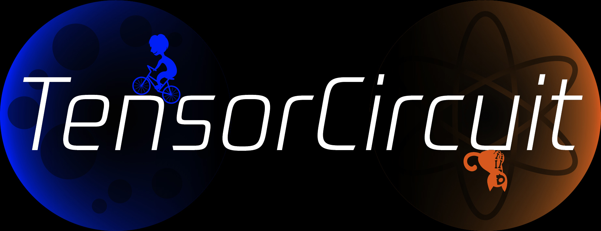

<p align="center">
  <a href="https://github.com/tencent-quantum-lab/tensorcircuit">
    
  </a>
</p>

<p align="center">
  <!-- tests (GitHub actions) -->
  <a href="https://github.com/tencent-quantum-lab/tensorcircuit/actions/workflows/ci.yml">
    
  </a>
  <!-- docs -->
  <a href="https://tensorcircuit.readthedocs.io/">
    
  </a>
  <!-- PyPI -->
  <a href="https://pypi.org/project/tensorcircuit/">
    
  </a>
  <!-- binder -->
  <a href="https://mybinder.org/v2/gh/refraction-ray/tc-env/master?urlpath=git-pull%3Frepo%3Dhttps%253A%252F%252Fgithub.com%252Ftencent-quantum-lab%252Ftensorcircuit%26urlpath%3Dlab%252Ftree%252Ftensorcircuit%252F%26branch%3Dmaster">
    
  </a>
  <!-- License -->
  <a href="./LICENSE">
    
  </a>
</p>

<p align="center"> English | <a href="README_cn.md"> 简体中文 </a></p>

TensorCircuit is the next generation of quantum circuit simulators with support for automatic differentiation, just-in-time compiling, hardware acceleration, and vectorized parallelism.

TensorCircuit is built on top of modern machine learning frameworks and is machine learning backend agnostic. It is specifically suitable for highly efficient simulations of quantum-classical hybrid paradigm and variational quantum algorithms.

## Getting Started

Please begin with [Quick Start](/docs/source/quickstart.rst).

For more information and introductions, please refer to helpful [example scripts](/examples) and [full documentation](https://tensorcircuit.readthedocs.io/). API docstrings and test cases in [tests](/tests) are also informative.

The following are some minimal demos.

- Circuit manipulation:

```python
import tensorcircuit as tc
c = tc.Circuit(2)
c.H(0)
c.CNOT(0,1)
c.rx(1, theta=0.2)
print(c.wavefunction())
print(c.expectation_ps(z=[0, 1]))
print(c.sample(allow_state=True, batch=1024, format="count_dict_bin"))
```

- Runtime behavior customization:

```python
tc.set_backend("tensorflow")
tc.set_dtype("complex128")
tc.set_contractor("greedy")
```

- Automatic differentiations with jit:

```python
def forward(theta):
    c = tc.Circuit(2)
    c.R(0, theta=theta, alpha=0.5, phi=0.8)
    return tc.backend.real(c.expectation((tc.gates.z(), [0])))

g = tc.backend.grad(forward)
g = tc.backend.jit(g)
theta = tc.array_to_tensor(1.0)
print(g(theta))
```

## Install

The package is written in pure Python and can be obtained via pip as:

```python
pip install tensorcircuit
```

We recommend you install this package with tensorflow also installed as:

```python
pip install tensorcircuit[tensorflow]
```

Other optional dependencies include `[torch]`, `[jax]` and `[qiskit]`.

For the nightly build of tensorcircuit with new features, try:

```python
pip uninstall tensorcircuit
pip install tensorcircuit-nightly
```

We also have [Docker support](/docker).

## Advantages

- Tensor network simulation engine based

- JIT, AD, vectorized parallelism compatible, GPU support

- Efficiency

  - Time: 10 to 10^6+ times acceleration compared to TensorFlow Quantum, Pennylane or Qiskit

  - Space: 600+ qubits 1D VQE workflow (converged energy inaccuracy: < 1%)

- Elegance

  - Flexibility: customized contraction, multiple ML backend/interface choices, multiple dtype precisions

  - API design: quantum for humans, less code, more power

## Contributing

### Status

This project is released by [Tencent Quantum Lab](https://quantum.tencent.com/) and is created and maintained by [Shi-Xin Zhang](https://github.com/refraction-ray) with current core authors [Shi-Xin Zhang](https://github.com/refraction-ray) and [Yu-Qin Chen](https://github.com/yutuer21). We also thank [contributions](https://github.com/tencent-quantum-lab/tensorcircuit/graphs/contributors) from the lab and the open source community.

### Citation

If this project helps in your research, please cite our software whitepaper published in Quantum:

[TensorCircuit: a Quantum Software Framework for the NISQ Era](https://quantum-journal.org/papers/q-2023-02-02-912/)

which is also a good introduction to the software.

### Guidelines

For contribution guidelines and notes, see [CONTRIBUTING](/CONTRIBUTING.md).

We welcome [issues](https://github.com/tencent-quantum-lab/tensorcircuit/issues), [PRs](https://github.com/tencent-quantum-lab/tensorcircuit/pulls), and [discussions](https://github.com/tencent-quantum-lab/tensorcircuit/discussions) from everyone, and these are all hosted on GitHub.

### Contributors

<!-- ALL-CONTRIBUTORS-LIST:START - Do not remove or modify this section -->
<!-- prettier-ignore-start -->
<!-- markdownlint-disable -->
<table>
  <tbody>
    <tr>
      <td align="center" valign="top" width="16.66%"><a href="https://re-ra.xyz"><br /><sub><b>Shixin Zhang</b></sub></a><br /><a href="https://github.com/tencent-quantum-lab/tensorcircuit/commits?author=refraction-ray" title="Code">💻</a> <a href="https://github.com/tencent-quantum-lab/tensorcircuit/commits?author=refraction-ray" title="Documentation">📖</a> <a href="#example-refraction-ray" title="Examples">💡</a> <a href="#ideas-refraction-ray" title="Ideas, Planning, & Feedback">🤔</a> <a href="#infra-refraction-ray" title="Infrastructure (Hosting, Build-Tools, etc)">🚇</a> <a href="#maintenance-refraction-ray" title="Maintenance">🚧</a> <a href="#research-refraction-ray" title="Research">🔬</a> <a href="https://github.com/tencent-quantum-lab/tensorcircuit/pulls?q=is%3Apr+reviewed-by%3Arefraction-ray" title="Reviewed Pull Requests">👀</a> <a href="#translation-refraction-ray" title="Translation">🌍</a> <a href="https://github.com/tencent-quantum-lab/tensorcircuit/commits?author=refraction-ray" title="Tests">⚠️</a> <a href="#tutorial-refraction-ray" title="Tutorials">✅</a> <a href="#talk-refraction-ray" title="Talks">📢</a> <a href="#question-refraction-ray" title="Answering Questions">💬</a></td>
      <td align="center" valign="top" width="16.66%"><a href="https://github.com/yutuer21"><br /><sub><b>Yuqin Chen</b></sub></a><br /><a href="https://github.com/tencent-quantum-lab/tensorcircuit/commits?author=yutuer21" title="Code">💻</a> <a href="https://github.com/tencent-quantum-lab/tensorcircuit/commits?author=yutuer21" title="Documentation">📖</a> <a href="#example-yutuer21" title="Examples">💡</a> <a href="#ideas-yutuer21" title="Ideas, Planning, & Feedback">🤔</a> <a href="#research-yutuer21" title="Research">🔬</a> <a href="https://github.com/tencent-quantum-lab/tensorcircuit/commits?author=yutuer21" title="Tests">⚠️</a> <a href="#tutorial-yutuer21" title="Tutorials">✅</a> <a href="#talk-yutuer21" title="Talks">📢</a></td>
      <td align="center" valign="top" width="16.66%"><a href="http://jiezhongqiu.com"><br /><sub><b>Jiezhong Qiu</b></sub></a><br /><a href="https://github.com/tencent-quantum-lab/tensorcircuit/commits?author=xptree" title="Code">💻</a> <a href="#example-xptree" title="Examples">💡</a> <a href="#ideas-xptree" title="Ideas, Planning, & Feedback">🤔</a> <a href="#research-xptree" title="Research">🔬</a></td>
      <td align="center" valign="top" width="16.66%"><a href="http://liwt31.github.io"><br /><sub><b>Weitang Li</b></sub></a><br /><a href="https://github.com/tencent-quantum-lab/tensorcircuit/commits?author=liwt31" title="Code">💻</a> <a href="https://github.com/tencent-quantum-lab/tensorcircuit/commits?author=liwt31" title="Documentation">📖</a> <a href="#ideas-liwt31" title="Ideas, Planning, & Feedback">🤔</a> <a href="#research-liwt31" title="Research">🔬</a> <a href="https://github.com/tencent-quantum-lab/tensorcircuit/commits?author=liwt31" title="Tests">⚠️</a> <a href="#talk-liwt31" title="Talks">📢</a></td>
      <td align="center" valign="top" width="16.66%"><a href="https://github.com/SUSYUSTC"><br /><sub><b>Jiace Sun</b></sub></a><br /><a href="https://github.com/tencent-quantum-lab/tensorcircuit/commits?author=SUSYUSTC" title="Code">💻</a> <a href="https://github.com/tencent-quantum-lab/tensorcircuit/commits?author=SUSYUSTC" title="Documentation">📖</a> <a href="#example-SUSYUSTC" title="Examples">💡</a> <a href="#ideas-SUSYUSTC" title="Ideas, Planning, & Feedback">🤔</a> <a href="#research-SUSYUSTC" title="Research">🔬</a> <a href="https://github.com/tencent-quantum-lab/tensorcircuit/commits?author=SUSYUSTC" title="Tests">⚠️</a></td>
      <td align="center" valign="top" width="16.66%"><a href="https://github.com/Zhouquan-Wan"><br /><sub><b>Zhouquan Wan</b></sub></a><br /><a href="https://github.com/tencent-quantum-lab/tensorcircuit/commits?author=Zhouquan-Wan" title="Code">💻</a> <a href="https://github.com/tencent-quantum-lab/tensorcircuit/commits?author=Zhouquan-Wan" title="Documentation">📖</a> <a href="#example-Zhouquan-Wan" title="Examples">💡</a> <a href="#ideas-Zhouquan-Wan" title="Ideas, Planning, & Feedback">🤔</a> <a href="#research-Zhouquan-Wan" title="Research">🔬</a> <a href="https://github.com/tencent-quantum-lab/tensorcircuit/commits?author=Zhouquan-Wan" title="Tests">⚠️</a> <a href="#tutorial-Zhouquan-Wan" title="Tutorials">✅</a></td>
    </tr>
    <tr>
      <td align="center" valign="top" width="16.66%"><a href="https://github.com/ls-iastu"><br /><sub><b>Shuo Liu</b></sub></a><br /><a href="#example-ls-iastu" title="Examples">💡</a> <a href="#research-ls-iastu" title="Research">🔬</a> <a href="#tutorial-ls-iastu" title="Tutorials">✅</a></td>
      <td align="center" valign="top" width="16.66%"><a href="https://github.com/YHPeter"><br /><sub><b>Hao Yu</b></sub></a><br /><a href="https://github.com/tencent-quantum-lab/tensorcircuit/commits?author=YHPeter" title="Code">💻</a> <a href="https://github.com/tencent-quantum-lab/tensorcircuit/commits?author=YHPeter" title="Documentation">📖</a> <a href="#infra-YHPeter" title="Infrastructure (Hosting, Build-Tools, etc)">🚇</a> <a href="https://github.com/tencent-quantum-lab/tensorcircuit/commits?author=YHPeter" title="Tests">⚠️</a> <a href="#tutorial-YHPeter" title="Tutorials">✅</a></td>
      <td align="center" valign="top" width="16.66%"><a href="https://github.com/SexyCarrots"><br /><sub><b>Xinghan Yang</b></sub></a><br /><a href="https://github.com/tencent-quantum-lab/tensorcircuit/commits?author=SexyCarrots" title="Documentation">📖</a> <a href="#translation-SexyCarrots" title="Translation">🌍</a> <a href="#tutorial-SexyCarrots" title="Tutorials">✅</a></td>
      <td align="center" valign="top" width="16.66%"><a href="https://github.com/JachyMeow"><br /><sub><b>JachyMeow</b></sub></a><br /><a href="#tutorial-JachyMeow" title="Tutorials">✅</a> <a href="#translation-JachyMeow" title="Translation">🌍</a></td>
      <td align="center" valign="top" width="16.66%"><a href="https://github.com/Mzye21"><br /><sub><b>Zhaofeng Ye</b></sub></a><br /><a href="#design-Mzye21" title="Design">🎨</a></td>
      <td align="center" valign="top" width="16.66%"><a href="https://github.com/erertertet"><br /><sub><b>erertertet</b></sub></a><br /><a href="https://github.com/tencent-quantum-lab/tensorcircuit/commits?author=erertertet" title="Code">💻</a> <a href="https://github.com/tencent-quantum-lab/tensorcircuit/commits?author=erertertet" title="Documentation">📖</a> <a href="https://github.com/tencent-quantum-lab/tensorcircuit/commits?author=erertertet" title="Tests">⚠️</a></td>
    </tr>
    <tr>
      <td align="center" valign="top" width="16.66%"><a href="https://github.com/yicongzheng"><br /><sub><b>Yicong Zheng</b></sub></a><br /><a href="#tutorial-yicongzheng" title="Tutorials">✅</a></td>
      <td align="center" valign="top" width="16.66%"><a href="https://marksong.tech"><br /><sub><b>Zixuan Song</b></sub></a><br /><a href="https://github.com/tencent-quantum-lab/tensorcircuit/commits?author=MarkSong535" title="Documentation">📖</a> <a href="#translation-MarkSong535" title="Translation">🌍</a></td>
      <td align="center" valign="top" width="16.66%"><a href="https://github.com/buwantaiji"><br /><sub><b>Hao Xie</b></sub></a><br /><a href="https://github.com/tencent-quantum-lab/tensorcircuit/commits?author=buwantaiji" title="Documentation">📖</a></td>
      <td align="center" valign="top" width="16.66%"><a href="https://github.com/pramitsingh0"><br /><sub><b>Pramit Singh</b></sub></a><br /><a href="https://github.com/tencent-quantum-lab/tensorcircuit/commits?author=pramitsingh0" title="Tests">⚠️</a></td>
      <td align="center" valign="top" width="16.66%"><a href="https://github.com/JAllcock"><br /><sub><b>Jonathan Allcock</b></sub></a><br /><a href="https://github.com/tencent-quantum-lab/tensorcircuit/commits?author=JAllcock" title="Documentation">📖</a> <a href="#ideas-JAllcock" title="Ideas, Planning, & Feedback">🤔</a> <a href="#talk-JAllcock" title="Talks">📢</a></td>
      <td align="center" valign="top" width="16.66%"><a href="https://github.com/nealchen2003"><br /><sub><b>nealchen2003</b></sub></a><br /><a href="https://github.com/tencent-quantum-lab/tensorcircuit/commits?author=nealchen2003" title="Documentation">📖</a></td>
    </tr>
    <tr>
      <td align="center" valign="top" width="16.66%"><a href="https://github.com/eurethia"><br /><sub><b>隐公观鱼</b></sub></a><br /><a href="https://github.com/tencent-quantum-lab/tensorcircuit/commits?author=eurethia" title="Code">💻</a> <a href="https://github.com/tencent-quantum-lab/tensorcircuit/commits?author=eurethia" title="Tests">⚠️</a></td>
    </tr>
  </tbody>
</table>

<!-- markdownlint-restore -->
<!-- prettier-ignore-end -->

<!-- ALL-CONTRIBUTORS-LIST:END -->
<!-- prettier-ignore-start -->
<!-- markdownlint-disable -->

<!-- markdownlint-restore -->
<!-- prettier-ignore-end -->

<!-- ALL-CONTRIBUTORS-LIST:END -->

## Research and Applications

### DQAS

For the application of Differentiable Quantum Architecture Search, see [applications](/tensorcircuit/applications).
Reference paper: https://arxiv.org/pdf/2010.08561.pdf.

### VQNHE

For the application of Variational Quantum-Neural Hybrid Eigensolver, see [applications](/tensorcircuit/applications).
Reference paper: https://arxiv.org/pdf/2106.05105.pdf and https://arxiv.org/pdf/2112.10380.pdf.

### VQEX - MBL

For the application of VQEX on MBL phase identification, see the [tutorial](/docs/source/tutorials/vqex_mbl.ipynb).
Reference paper: https://arxiv.org/pdf/2111.13719.pdf.
