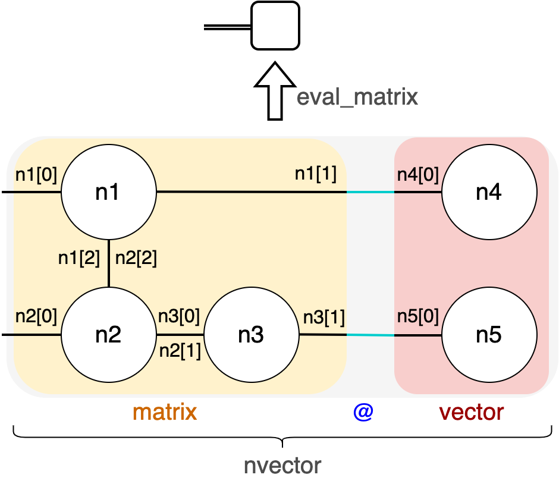

=================================
TensorCircuit: What is inside?
=================================

This part of the documentation is mainly for advanced users and developers who want to learn more about what happened behind the scene and delve into the codebase.

Overview of Modules
-----------------------

**Core Modules:**

- :py:mod:`tensorcircuit.abstractcircuit` and :py:mod:`tensorcircuit.basecircuit`: Hierarchical abstraction of circuit class.

- :py:mod:`tensorcircuit.circuit`: The core object :py:obj:`tensorcircuit.circuit.Circuit`. It supports circuit construction, simulation, representation, and visualization without noise or with noise using the Monte Carlo trajectory approach.

- :py:mod:`tensorcircuit.cons`: Runtime ML backend, dtype and contractor setups. We provide three sets of set methods for global setup, function level setup using function decorators, and context setup using ``with`` context managers. We also include customized contractor infrastructures in this module.

- :py:mod:`tensorcircuit.gates`: Definition of quantum gates, either fixed ones or parameterized ones, as well as :py:obj:`tensorcircuit.gates.GateF` class for gates.

**Backend Agnostic Abstraction:**

- :py:mod:`tensorcircuit.backends` provides a set of backend API and the corresponding implementation on Numpy, Jax, TensorFlow, and PyTorch backends. These backends are inherited from the TensorNetwork package and are highly customized.

**Noisy Simulation Related Modules:**

- :py:mod:`tensorcircuit.channels`: Definition of quantum noise channels.

- :py:mod:`tensorcircuit.densitymatrix`: Referenced and highly efficient implementation of ``tc.DMCircuit`` class, with similar set API of ``tc.Circuit`` while simulating the noise in the full form of the density matrix.

- :py:mod:`tensorcircuit.noisemodel`: The global noise configuration and circuit noisy method APIs

**ML Interfaces Related Modules:**

- :py:mod:`tensorcircuit.interfaces`: Provide interfaces when quantum simulation backend is different from neural libraries. Currently include PyTorch, TensorFlow, NumPy and SciPy optimizer interfaces.

- :py:mod:`tensorcircuit.keras`: Provide TensorFlow Keras layers, as well as wrappers of jitted function, save/load from tf side.

- :py:mod:`tensorcircuit.torchnn`: Provide PyTorch nn Modules.

**MPS and MPO Utiliy Modules:**

- :py:mod:`tensorcircuit.quantum`: Provide definition and classes for Matrix Product States as well as Matrix Product Operators, we also include various quantum physics and quantum information quantities in this module.

**MPS Based Simulator Modules:**

- :py:mod:`tensorcircuit.mps_base`: Customized and jit/AD compatible MPS class from TensorNetwork package.

- :py:mod:`tensorcircuit.mpscircuit`: :py:obj:`tensorcircuit.mpscircuit.MPSCircuit` class with similar (but subtly different) APIs as ``tc.Circuit``, where the simulation engine is based on MPS TEBD.

**Supplemental Modules:**

- :py:mod:`tensorcircuit.simplify`: Provide tools and utility functions to simplify the tensornetworks before the real contractions.

- :py:mod:`tensorcircuit.experimental`: Experimental functions, long and stable support is not guaranteed.

- :py:mod:`tensorcircuit.utils`: Some general function tools that are not quantum at all.

- :py:mod:`tensorcircuit.vis`: Visualization code for circuit drawing.

- :py:mod:`tensorcircuit.translation`: Translate circuit object to circuit object in other quantum packages.

**Processing and error mitigation on sample results:**

- :py:mod:`tensorcircuit.results`: Provide tools to process count dict and to apply error mitigation.

**Cloud quantum hardware access module:**

- :py:mod:`tensorcircuit.cloud`: Provide quantum cloud SDK that can access and program the real quantum hardware.

- :py:mod:`tensorcircuit.compiler`: Provide compiler chains to compile and transform quantum circuits.

**Shortcuts and Templates for Circuit Manipulation:**

- :py:mod:`tensorcircuit.templates`: provide handy shortcuts functions for expectation or circuit building patterns.

**Applications:**

- :py:mod:`tensorcircuit.applications`: most code here is not maintained and deprecated, use at your own risk.

.. note::

    Recommend reading order -- only read the part of code you care about for your purpose. 
    If you want to get an overview of the codebase, please read ``tc.circuit`` followed by ``tc.cons`` and ``tc.gates``.

Relation between TensorCircuit and TensorNetwork
---------------------------------------------------

TensorCircuit has a strong connection with the `TensorNetwork package <https://github.com/google/TensorNetwork>`_ released by Google. Since the TensorNetwork package has poor documentation and tutorials, most of the time, we need to delve into the codebase of TensorNetwork to figure out what happened. In other words, to read the TensorCircuit codebase, one may have to frequently refer to the TensorNetwork codebase.

Inside TensorCircuit, we heavily utilize TensorNetwork-related APIs from the TensorNetwork package and highly customized several modules from TensorNetwork by inheritance and rewriting:

- We implement our own /backends from TensorNetwork's /backends by adding much more APIs and fixing lots of bugs in TensorNetwork's implementations on certain backends via monkey patching. (The upstream is inactive and not that responsive anyhow.)

- We borrow TensorNetwork's code in /quantum to our ``tc.quantum`` module, since TensorNetwork has no ``__init__.py`` file to export these MPO and MPS related objects. Of course, we have made substantial improvements since then.

- We borrow the TensorNetwork's code in /matrixproductstates as ``tc.mps_base`` for bug fixing and jit/AD compatibility, so that we have better support for our MPS based quantum circuit simulator.

Relations of Circuit-like classes
---------------------------------------

.. code-block::

                                           |- Circuit
                        |- BaseCircuit --- |
    AbstractCircuit  ---|                  |- DMCircuitReference --- DMCircuit
                        |- MPSCircuit

QuOperator/QuVector and MPO/MPS
---------------------------------------------------

:py:class:`tensorcircuit.quantum.QuOperator`, :py:class:`tensorcircuit.quantum.QuVector` and :py:class:`tensorcircuit.quantum.QuAdjointVector` are classes adopted from TensorNetwork package.
They behave like a matrix/vector (column or row) when interacting with other ingredients while the inner structure is maintained by the tensornetwork for efficiency and compactness.

We use code examples and associated tensor diagrams to illustrate these object abstractions.

.. note::

    ``QuOperator`` can express MPOs and ``QuVector`` can express MPSs, but they can express more than these fixed structured tensor networks.

.. code-block:: python

    import tensornetwork as tn

    n1 = tn.Node(np.ones([2, 2, 2]))
    n2 = tn.Node(np.ones([2, 2, 2]))
    n3 = tn.Node(np.ones([2, 2]))
    n1[2]^n2[2]
    n2[1]^n3[0]

    matrix = tc.quantum.QuOperator(out_edges=[n1[0], n2[0]], in_edges=[n1[1], n3[1]])

    n4 = tn.Node(np.ones([2]))
    n5 = tn.Node(np.ones([2]))

    vector = tc.quantum.QuVector([n4[0], n5[0]])

    nvector = matrix @ vector 

    assert type(nvector) == tc.quantum.QuVector
    nvector.eval_matrix() 
    # array([[16.], [16.], [16.], [16.]])

Note how in this example, ``matrix`` is not a typical MPO but still can be expressed as ``QuOperator``. Indeed, any tensor network with two sets of dangling edges of the same dimension can be treated as ``QuOperator``. ``QuVector`` is even more flexible since we can treat all dangling edges as the vector dimension.

Also, note how ``^`` is overloaded as ``tn.connect`` to connect edges between different nodes in TensorNetwork. And indexing the node gives the edges of the node, eg. ``n1[0]`` means the first edge of node ``n1``.

The convention to define the ``QuOperator`` is firstly giving ``out_edges`` (left index or row index of the matrix) and then giving ``in_edges`` (right index or column index of the matrix). The edges list contains edge objects from the TensorNetwork library.

Such QuOperator/QuVector abstraction support various calculations only possible on matrix/vectors, such as matmul (``@``), adjoint (``.adjoint()``), scalar multiplication (``*``), tensor product (``|``), and partial trace (``.partial_trace(subsystems_to_trace_out)``).
To extract the matrix information of these objects, we can use ``.eval()`` or ``.eval_matrix()``, the former keeps the shape information of the tensor network while the latter gives the matrix representation with shape rank 2.

Quantum Cloud SDK: Layerwise API design
-----------------------------------------------------

From lower level to higher level, a view of API layers invoking QPU calls

- Vendor specific implementation of functional API in, e.g., :py:mod:`tensorcircuit.cloud.tencent`

- Provider agnostic functional lower level API for task/device management in :py:mod:`tensorcircuit.cloud.apis`

- Object oriented abstraction for Provider/Device/Task in :py:mod:`tensorcircuit.cloud.abstraction`

- Unified batch submission interface as standarized in :py:meth:`tensorcircuit.cloud.wrapper.batch_submit_template`

- Numerical and experimental unified all-in-one interface as :py:meth:`tensorcircuit.cloud.wrapper.batch_expectation_ps`

- Application level code with QPU calls built directly on ``batch_expectation_ps`` or more fancy algorithms can be built on ``batch_submit_func`` so that these algorithms can be reused as long as one function ``batch_submit_func`` is defined for a given vendor (cheaper than defining a new provider from lower level).

.. Note::

    For compiler, error mitigation and results post-processing parts, they can be carefully designed to decouple with the QPU calls,
    so they are separately implemented in :py:mod:`tensorcircuit.compiler` and :py:mod:`tensorcircuit.results`, 
    and they can be independently useful even without tc's cloud access.
