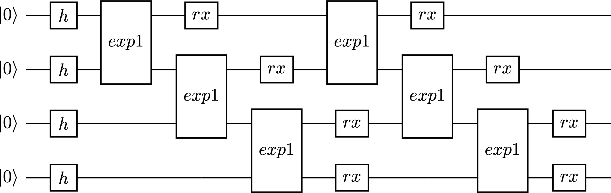
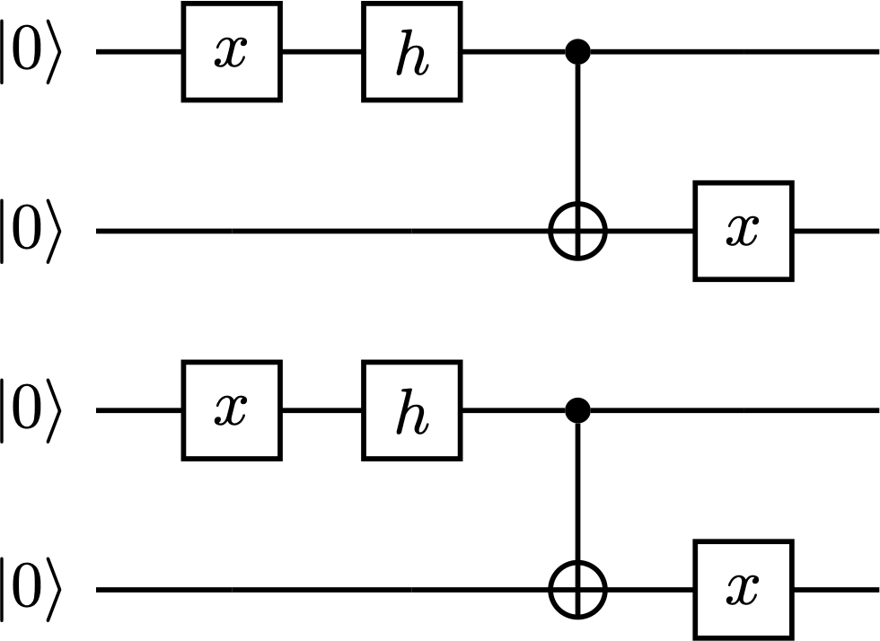

================
Quick Start
================

Installation
--------------

- For x86 Linux or Mac, 

``pip install tensorcircuit`` 

is in general enough. 
Either pip from conda or other python env managers is fine.

Since there are many optional packages for various features, 
the users may need to install more pip packages when required. 

- For Linux with Nvidia GPU,
please refer to the GPU aware installation guide of corresponding machine learning frameworks: 
`TensorFlow <https://www.tensorflow.org/install/gpu>`_, 
`Jax <https://github.com/google/jax#pip-installation-gpu-cuda>`_, 
or `PyTorch <https://pytorch.org/get-started/locally/>`_.

Docker is also recommended (especially Linux + Nvidia GPU setup): 

``sudo docker run -it --network host --gpus all tensorcircuit/tensorcircuit``.

- For Windows, due to the lack of support for Jax, we recommend to use docker or WSL, please refer to `TC via windows docker <contribs/development_windows.html>`_ or `TC via WSL <contribs/development_wsl2.html>`_.

- For Mac with M series chips (arm architecture), please refer to `TC on Mac M series <contribs/development_MacARM.html>`_.

Overall, the installation of TensorCircuit is simple, since it is purely in Python and hence very portable. 
As long as the users can take care of the installation of ML frameworks on the corresponding system, TensorCircuit will work as expected.

.. Note::
    We also provide a nightly build of tensorcircuit via PyPI which can be accessed by
    ``pip uninstall tensorcircuit``, then
    ``pip install tensorcircuit-nightly``

Circuit Object
------------------

The basic object for TensorCircuit is ``tc.Circuit``. 

Initialize the circuit with the number of qubits ``c=tc.Circuit(n)``.

**Input States:**

The default input function for the circuit is :math:`\vert 0^n \rangle`. One can change this to other wavefunctions by directly feeding the inputs state vectors w: ``c=tc.Circuit(n, inputs=w)``.

One can also feed matrix product states as input states for the circuit, but we leave MPS/MPO usage for future sections.

**Quantum Gates:**

We can apply gates on circuit objects. For example, using ``c.H(1)`` or ``c.rx(2, theta=0.2)``, we can apply Hadamard gate on qubit 1 (0-based) or apply Rx gate on qubit 2 as :math:`e^{-i\theta/2 X}`.

The same rule also applies to multi-qubit gates, such as ``c.cnot(0, 1)``.

There are also highly customizable gates, two instances are:

- ``c.exp1(0, 1, unitary=m, theta=0.2)`` which is for the exponential gate :math:`e^{i\theta m}` of any matrix m as long as :math:`m^2=1`.

- ``c.any(0, 1, unitary=m)`` which is for applying the unitary gate m on the circuit.

These two examples are flexible and support gates on any number of qubits.

**Measurements and Expectations:**

The most straightforward way to get the output from the circuit object is by getting the output wavefunction in vector form as ``c.state()``.

For bitstring sampling, we have ``c.perfect_sampling()`` which returns the bitstring and the corresponding probability amplitude.

To measure part of the qubits, we can use ``c.measure(0, 1)``, if we want to know the corresponding probability of the measurement output, try ``c.measure(0, 1, with_prob=True)``. The measure API is by default non-jittable, but we also have a jittable version as ``c.measure_jit(0, 1)``.

The measurement and sampling utilize advanced algorithms based on tensornetwork and thus require no knowledge or space for the full wavefunction.

See the example below:

.. code-block:: python

    K = tc.set_backend("jax")
    @K.jit
    def sam(key):
        K.set_random_state(key)
        n = 50
        c = tc.Circuit(n)
        for i in range(n):
            c.H(i)
        return c.perfect_sampling()

    sam(jax.random.PRNGKey(42))
    sam(jax.random.PRNGKey(43))

To compute expectation values for local observables, we have ``c.expectation([tc.gates.z(), [0]], [tc.gates.z(), [1]])`` for :math:`\langle Z_0Z_1 \rangle` or ``c.expectation([tc.gates.x(), [0]])`` for :math:`\langle X_0 \rangle`.

This expectation API is rather flexible, as one can measure an m on several qubits as ``c.expectation([m, [0, 1, 2]])``.

We can also extract the unitary matrix underlying the whole circuit as follows:

.. code-block:: python

    >>> n = 2
    >>> c = tc.Circuit(n, inputs=tc.backend.eye(2**n))
    >>> c.X(1)
    >>> tc.backend.reshapem(c.state())
    array([[0.+0.j, 1.+0.j, 0.+0.j, 0.+0.j],
        [1.+0.j, 0.+0.j, 0.+0.j, 0.+0.j],
        [0.+0.j, 0.+0.j, 0.+0.j, 1.+0.j],
        [0.+0.j, 0.+0.j, 1.+0.j, 0.+0.j]], dtype=complex64)

**Circuit Transformations:**

We currently support transform ``tc.Circuit`` from and to Qiskit ``QuantumCircuit`` object.

Export to Qiskit (possible for further hardware experiment, compiling, and visualization): ``c.to_qiskit()``.

Import from Qiskit: ``c = tc.Circuit.from_qiskit(QuantumCircuit, n)``.
Parameterized Qiskit circuit is supported by passing the parameters to the ``binding_parameters`` argument
of the ``from_qiskit`` function, similar to the ``assign_parameters`` function in Qiskit.

**Circuit Visualization:** 

``c.vis_tex()`` can generate tex code for circuit visualization based on LaTeX `quantikz <https://arxiv.org/abs/1809.03842>`__ package.

There are also some automatic pipeline helper functions to directly generate figures from tex code, but they require extra installations in the environment.

``render_pdf(tex)`` function requires full installation of LaTeX locally. And in the Jupyter environment, we may prefer ``render_pdf(tex, notebook=True)`` to return jpg figures, which further require wand magicwand library installed, see `here <https://docs.wand-py.org/en/latest/>`__.

Or since we can transform ``tc.Circuit`` into QuantumCircuit easily, we have a simple pipeline to first transform ``tc.Circuit`` into Qiskit and then call the visualization built in Qiskit. Namely, we have ``c.draw()`` API.

**Circuit Intermediate Representation:**

TensorCircuit provides its own circuit IR as a python list of dicts. This IR can be further utilized to run compiling, generate serialization qasm, or render circuit figures.

The IR is given as a list, each element is a dict containing information on one gate that is applied to the circuit. Note gate attr in the dict is a python function that returns the gate's node.

.. code-block:: python

    >>> c = tc.Circuit(2)
    >>> c.cnot(0, 1)
    >>> c.crx(1, 0, theta=0.2)
    >>> c.to_qir()
    [{'gate': cnot, 'index': (0, 1), 'name': 'cnot', 'split': None}, {'gate': crx, 'index': (1, 0), 'name': 'crx', 'split': None, 'parameters': {'theta': 0.2}}]

Programming Paradigm
-------------------------

The most common case and the most typical programming paradigm for TensorCircuit are to evaluate the circuit output and the corresponding quantum gradients, which is common in variational quantum algorithms.

.. code-block:: python

    import tensorcircuit as tc

    K = tc.set_backend("tensorflow")

    n = 1

    def loss(params, n):
        c = tc.Circuit(n)
        for i in range(n):
            c.rx(i, theta=params[0, i])
        for i in range(n):
            c.rz(i, theta=params[1, i])
        loss = 0.0
        for i in range(n):
            loss += c.expectation([tc.gates.z(), [i]])
        return K.real(loss)

    vgf = K.jit(K.value_and_grad(loss), static_argnums=1)
    params = K.implicit_randn([2, n])
    print(vgf(params, n))  # get the quantum loss and the gradient

Also for a non-quantum example (linear regression) demonstrating the backend agnostic feature, variables with pytree support, AD/jit/vmap usage, and variational optimization loops. Please refer to the example script: `linear regression example <https://github.com/tencent-quantum-lab/tensorcircuit/blob/master/examples/universal_lr.py>`_.
This example might be more friendly to the machine learning community since it is purely classical while also showcasing the main features and paradigms of tensorcircuit.

If the user has no intention to maintain the application code in a backend agnostic fashion, the API for ML frameworks can be more handily used and interleaved with the TensorCircuit API.

.. code-block:: python

    import tensorcircuit as tc
    import tensorflow as tf

    K = tc.set_backend("tensorflow")

    n = 1

    def loss(params, n):
        c = tc.Circuit(n)
        for i in range(n):
            c.rx(i, theta=params[0, i])
        for i in range(n):
            c.rz(i, theta=params[1, i])
        loss = 0.0
        for i in range(n):
            loss += c.expectation([tc.gates.z(), [i]])
        return tf.math.real(loss)

    def vgf(params, n):
        with tf.GradientTape() as tape:
            tape.watch(params)
            l = loss(params, n)
        return l, tape.gradient(l, params)

    vgf = tf.function(vgf)
    params = tf.random.normal([2, n])
    print(vgf(params, n))  # get the quantum loss and the gradient

Automatic Differentiation, JIT, and Vectorized Parallelism
-------------------------------------------------------------

For concepts of AD, JIT and VMAP, please refer to `Jax documentation <https://jax.readthedocs.io/en/latest/jax-101/index.html>`__ .

The related API design in TensorCircuit closely follows the functional programming design pattern in Jax with some slight differences. So we strongly recommend users learn some basics about Jax no matter which ML backend they intend to use.

**AD Support:**

Gradients, vjps, jvps, natural gradients, Jacobians, and Hessians.
AD is the base for all modern machine learning libraries.

**JIT Support:**

Parameterized quantum circuits can run in a blink. Always use jit if the circuit will get evaluations multiple times, it can greatly boost the simulation with two or three order time reduction. But also be cautious, users need to be familiar with jit, otherwise, the jitted function may return unexpected results or recompile on every hit (wasting lots of time).
To learn more about the jit mechanism, one can refer to documentation or blogs on ``tf.function`` or ``jax.jit``, though these two still have subtle differences.

**VMAP Support:**

Inputs, parameters, measurements, circuit structures, and Monte Carlo noise can all be evaluated in parallel.
To learn more about vmap mechanism, one can refer to documentation or blogs on ``tf.vectorized_map`` or ``jax.vmap``.

Backend Agnosticism
-------------------------

TensorCircuit supports TensorFlow, Jax, and PyTorch backends. We recommend using TensorFlow or Jax backend since PyTorch lacks advanced jit and vmap features.

The backend can be set as ``K=tc.set_backend("jax")`` and ``K`` is the backend with a full set of APIs as a conventional ML framework, which can also be accessed by ``tc.backend``.

.. code-block:: python

    >>> import tensorcircuit as tc
    >>> K = tc.set_backend("tensorflow")
    >>> K.ones([2,2])
    <tf.Tensor: shape=(2, 2), dtype=complex64, numpy=
    array([[1.+0.j, 1.+0.j],
        [1.+0.j, 1.+0.j]], dtype=complex64)>
    >>> tc.backend.eye(3)
    <tf.Tensor: shape=(3, 3), dtype=complex64, numpy=
    array([[1.+0.j, 0.+0.j, 0.+0.j],
        [0.+0.j, 1.+0.j, 0.+0.j],
        [0.+0.j, 0.+0.j, 1.+0.j]], dtype=complex64)>
    >>> tc.set_backend("jax")
    <tensorcircuit.backends.jax_backend.JaxBackend object at 0x7fb00e0fd6d0>
    >>> tc.backend.name
    'jax'
    >>> tc.backend.implicit_randu()
    WARNING:absl:No GPU/TPU found, falling back to CPU. (Set TF_CPP_MIN_LOG_LEVEL=0 and rerun for more info.)
    DeviceArray([0.7400521], dtype=float32)

The supported APIs in the backend come from two sources, one part is implemented in `TensorNetwork package <https://github.com/google/TensorNetwork/blob/master/tensornetwork/backends/abstract_backend.py>`__
and the other part is implemented in `TensorCircuit package <modules.html#module-tensorcircuit.backends>`__. To see all the backend agnostic APIs, try:

.. code-block:: python

    >>> [s for s in dir(tc.backend) if not s.startswith("_")]
    ['abs',
    'acos',
    'acosh',
    'addition',
    'adjoint',
    'arange',
    'argmax',
    'argmin',
    'asin',
    'asinh',
    'atan',
    'atan2',
    'atanh',
    'broadcast_left_multiplication',
    'broadcast_right_multiplication',
    'cast',
    'cholesky',
    'concat',
    'cond',
    'conj',
    'convert_to_tensor',
    'coo_sparse_matrix',
    'coo_sparse_matrix_from_numpy',
    'copy',
    'cos',
    'cosh',
    'cumsum',
    'deserialize_tensor',
    'device',
    'device_move',
    'diagflat',
    'diagonal',
    'divide',
    'dtype',
    'eigh',
    'eigs',
    'eigsh',
    'eigsh_lanczos',
    'eigvalsh',
    'einsum',
    'eps',
    'exp',
    'expm',
    'eye',
    'from_dlpack',
    'gather1d',
    'get_random_state',
    'gmres',
    'grad',
    'hessian',
    'i',
    'imag',
    'implicit_randc',
    'implicit_randn',
    'implicit_randu',
    'index_update',
    'inv',
    'is_sparse',
    'is_tensor',
    'item',
    'jacbwd',
    'jacfwd',
    'jacrev',
    'jit',
    'jvp',
    'kron',
    'left_shift',
    'log',
    'matmul',
    'max',
    'mean',
    'min',
    'mod',
    'multiply',
    'name',
    'norm',
    'numpy',
    'one_hot',
    'onehot',
    'ones',
    'outer_product',
    'pivot',
    'power',
    'probability_sample',
    'qr',
    'randn',
    'random_split',
    'random_uniform',
    'real',
    'relu',
    'reshape',
    'reshape2',
    'reshapem',
    'reverse',
    'right_shift',
    'rq',
    'scatter',
    'searchsorted',
    'serialize_tensor',
    'set_random_state',
    'shape_concat',
    'shape_prod',
    'shape_tensor',
    'shape_tuple',
    'sigmoid',
    'sign',
    'sin',
    'sinh',
    'size',
    'sizen',
    'slice',
    'softmax',
    'solve',
    'sparse_dense_matmul',
    'sparse_shape',
    'sqrt',
    'sqrtmh',
    'stack',
    'stateful_randc',
    'stateful_randn',
    'stateful_randu',
    'std',
    'stop_gradient',
    'subtraction',
    'sum',
    'svd',
    'switch',
    'tan',
    'tanh',
    'tensordot',
    'tile',
    'to_dense',
    'to_dlpack',
    'trace',
    'transpose',
    'tree_flatten',
    'tree_map',
    'tree_unflatten',
    'unique_with_counts',
    'value_and_grad',
    'vectorized_value_and_grad',
    'vjp',
    'vmap',
    'vvag',
    'zeros']

Switch the Dtype
--------------------

TensorCircuit supports simulation using 32/64 bit precession. The default dtype is 32-bit as "complex64".
Change this by ``tc.set_dtype("complex128")``.

``tc.dtypestr`` always returns the current dtype string: either "complex64" or "complex128".

Setup the Contractor
------------------------

TensorCircuit is a tensornetwork contraction-based quantum circuit simulator. A contractor is for searching for the optimal contraction path of the circuit tensornetwork.

There are various advanced contractors provided by third-party packages, such as `opt-einsum <https://github.com/dgasmith/opt_einsum>`__ and `cotengra <https://github.com/jcmgray/cotengra>`__.

`opt-einsum` is shipped with TensorNetwork package. To use cotengra, one needs to pip install it; kahypar is also recommended to install with cotengra.

Some setup cases:

.. code-block:: python

    import tensorcircuit as tc
    
    # 1. cotengra contractors, have better and consistent performance for large circuit simulation
    import cotengra as ctg

    optr = ctg.ReusableHyperOptimizer(
        methods=["greedy", "kahypar"],
        parallel=True,
        minimize="flops",
        max_time=120,
        max_repeats=4096,
        progbar=True,
    )
    tc.set_contractor("custom", optimizer=optr, preprocessing=True)
    # by preprocessing set as True, tensorcircuit will automatically merge all single-qubit gates into entangling gates

    # 2.  RandomGreedy contractor
    tc.set_contractor("custom_stateful", optimizer=oem.RandomGreedy, max_time=60, max_repeats=128, minimize="size")

    # 3. state simulator like contractor provided by tensorcircuit, maybe better when there is ring topology for two-qubit gate layout
    tc.set_contractor("plain-experimental")

For advanced configurations on cotengra contractors, please refer to cotengra `doc <https://cotengra.readthedocs.io/en/latest/advanced.html>`__ and more fancy examples can be found at `contractor tutorial <https://github.com/tencent-quantum-lab/tensorcircuit-tutorials/blob/master/tutorials/contractors.ipynb>`__.

**Setup in Function or Context Level**

Beside global level setup, we can also setup the backend, the dtype, and the contractor at the function level or context manager level:

.. code-block:: python

    with tc.runtime_backend("tensorflow"):
        with tc.runtime_dtype("complex128"):
            m = tc.backend.eye(2)
    n = tc.backend.eye(2)
    print(m, n) # m is tf tensor while n is numpy array

    @tc.set_function_backend("tensorflow")
    @tc.set_function_dtype("complex128")
    def f():
        return tc.backend.eye(2)
    print(f()) # complex128 tf tensor

Noisy Circuit Simulation
----------------------------

**Monte Carlo State Simulator:**

For the Monte Carlo trajectory noise simulator, the unitary Kraus channel can be handled easily. TensorCircuit also supports fully jittable and differentiable general Kraus channel Monte Carlo simulation, though.

.. code-block:: python

    def noisecircuit(random):
        c = tc.Circuit(1)
        c.x(0)
        c.thermalrelaxation(
            0,
            t1=300,
            t2=400,
            time=1000,
            method="ByChoi",
            excitedstatepopulation=0,
            status=random,
        )
        return c.expectation_ps(z=[0])

    K = tc.set_backend("tensorflow")
    noisec_vmap = K.jit(K.vmap(noisecircuit, vectorized_argnums=0))
    nmc = 10000
    random = K.implicit_randu(nmc)
    valuemc = K.mean(K.numpy(noisec_vmap(random)))
    # (0.931+0j)

**Density Matrix Simulator:**

Density matrix simulator ``tc.DMCircuit`` simulates the noise in a full form, but takes twice qubits to do noiseless simulation. The API is the same as ``tc.Circuit``.

.. code-block:: python

    def noisecircuitdm():
        dmc = tc.DMCircuit(1)
        dmc.x(0)
        dmc.thermalrelaxation(
            0, t1=300, t2=400, time=1000, method="ByChoi", excitedstatepopulation=0
        )
        return dmc.expectation_ps(z=[0])

    K = tc.set_backend("tensorflow")
    noisec_jit = K.jit(noisecircuitdm)
    valuedm = noisec_jit()
    # (0.931+0j)

**Experiment with quantum errors:**

Multiple quantum errors can be added on circuit.

.. code-block:: python

    c = tc.Circuit(1)
    c.x(0)
    c.thermalrelaxation(
        0, t1=300, t2=400, time=1000, method="ByChoi", excitedstatepopulation=0
    )
    c.generaldepolarizing(0, p=0.01, num_qubits=1)
    c.phasedamping(0, gamma=0.2)
    c.amplitudedamping(0, gamma=0.25, p=0.2)
    c.reset(0)
    c.expectation_ps(z=[0])

**Experiment with readout error:**

Readout error can be added in experiments for sampling and expectation value calculation.

.. code-block:: python

    c = tc.Circuit(3)
    c.X(0)
    readout_error = []
    readout_error.append([0.9, 0.75])  # readout error of qubit 0   p0|0=0.9, p1|1=0.75
    readout_error.append([0.4, 0.7])  # readout error of qubit 1
    readout_error.append([0.7, 0.9])  # readout error of qubit 2
    value = c.sample_expectation_ps(z=[0, 1, 2], readout_error=readout_error)
    # tf.Tensor(0.039999977, shape=(), dtype=float32)
    instances = c.sample(
        batch=3,
        allow_state=True,
        readout_error=readout_error,
        random_generator=tc.backend.get_random_state(42),
        format_="sample_bin"
    )
    # tf.Tensor(
    # [[1 0 0]
    # [1 0 0]
    # [1 0 1]], shape=(3, 3), dtype=int32)

MPS and MPO
----------------

TensorCircuit has its class for MPS and MPO originally defined in TensorNetwork as ``tc.QuVector``, ``tc.QuOperator``.

``tc.QuVector`` can be extracted from ``tc.Circuit`` as the tensor network form for the output state (uncontracted) by ``c.quvector()``.

The QuVector forms a wavefunction w, which can also be fed into Circuit as the inputs state as ``c=tc.Circuit(n, mps_inputs=w)``.

- MPS as input state for circuit

The MPS/QuVector representation of the input state has a more efficient and compact form.

.. code-block:: python

    n = 3
    nodes = [tc.gates.Gate(np.array([0.0, 1.0])) for _ in range(n)]
    mps = tc.quantum.QuVector([nd[0] for nd in nodes])
    c = tc.Circuit(n, mps_inputs=mps)
    c.x(0)
    c.expectation_ps(z=[0])
    # 1.0

- MPS as (uncomputed) output state for circuit

For example, a quick way to calculate the wavefunction overlap without explicitly computing the state amplitude is given as below:

.. code-block:: python

    >>> c = tc.Circuit(3)
    >>> [c.H(i) for i in range(3)]
    [None, None, None]
    >>> c.cnot(0, 1)
    >>> c2 = tc.Circuit(3)
    >>> [c2.H(i) for i in range(3)]
    [None, None, None]
    >>> c2.cnot(1, 0)
    >>> q = c.quvector()
    >>> q2 = c2.quvector().adjoint()
    >>> (q2@q).eval_matrix()
    array([[0.9999998+0.j]], dtype=complex64)

- MPO as the gate on the circuit

Instead of a common quantum gate in matrix/node format, we can directly apply a gate in MPO/QuOperator format.

.. code-block:: python

    >>> x0, x1 = tc.gates.x(), tc.gates.x()
    >>> mpo = tc.quantum.QuOperator([x0[0], x1[0]], [x0[1], x1[1]])
    >>> c = tc.Circuit(2)
    >>> c.mpo(0, 1, mpo=mpo)
    >>> c.state()
    array([0.+0.j, 0.+0.j, 0.+0.j, 1.+0.j], dtype=complex64)

The representative gate defined in MPO format is the ``multicontrol`` gate.

- MPO as the operator for expectation evaluation on a circuit

We can also measure operator expectation on the circuit output state where the operator is in MPO/QuOperator format.

.. code-block:: python

    >>> z0, z1 = tc.gates.z(), tc.gates.z()
    >>> mpo = tc.quantum.QuOperator([z0[0], z1[0]], [z0[1], z1[1]])
    >>> c = tc.Circuit(2)
    >>> c.X(0)
    >>> tc.templates.measurements.mpo_expectation(c, mpo)
    -1.0

Interfaces
-------------

**PyTorch Interface to Hybrid with PyTorch Modules:**

As we have mentioned in the backend section, the PyTorch backend may lack advanced features. This doesn't mean we cannot hybrid the advanced circuit module with PyTorch neural module. We can run the quantum function on TensorFlow or Jax backend while wrapping it with a Torch interface.

.. code-block:: python

    import tensorcircuit as tc
    from tensorcircuit.interfaces import torch_interface
    import torch

    tc.set_backend("tensorflow")

    def f(params):
        c = tc.Circuit(1)
        c.rx(0, theta=params[0])
        c.ry(0, theta=params[1])
        return c.expectation([tc.gates.z(), [0]])

    f_torch = torch_interface(f, jit=True)

    a = torch.ones([2], requires_grad=True)
    b = f_torch(a)
    c = b ** 2
    c.backward()

    print(a.grad)

For a GPU/CPU, torch/tensorflow, quantum/classical hybrid machine learning pipeline enabled by tensorcircuit, see `example script <https://github.com/tencent-quantum-lab/tensorcircuit/blob/master/examples/hybrid_gpu_pipeline.py>`__.

We also provider wrapper of quantum function for torch module as :py:meth:`tensorcircuit.TorchLayer` alias to :py:meth:`tensorcircuit.torchnn.QuantumNet`.

For ``TorchLayer``, ``use_interface=True`` is by default, which natively allow the quantum function defined on other tensorcircuit backends, such as jax or tf for speed consideration.

``TorchLayer`` can process multiple input arguments as multiple function inputs, following torch practice.

.. code-block:: python

    n = 3
    p = 0.1
    K = tc.backend
    torchb = tc.get_backend("pytorch")

    def f(state, noise, weights):
        c = tc.Circuit(n, inputs=state)
        for i in range(n):
            c.rz(i, theta=weights[i])
        for i in range(n):
            c.depolarizing(i, px=p, py=p, pz=p, status=noise[i])
        return K.real(c.expectation_ps(x=[0]))

    layer = tc.TorchLayer(f, [n], use_vmap=True, vectorized_argnums=[0, 1])
    state = torchb.ones([2, 2**n]) / 2 ** (n / 2)
    noise = 0.2 * torchb.ones([2, n], dtype="float32")
    l = layer(state,noise)
    lsum = torchb.sum(l)
    print(l)
    lsum.backward()
    for p in layer.parameters():
        print(p.grad)

**TensorFlow interfaces:**

Similar rules apply similar as torch interface. The interface can even be used within jit environment outside.
See :py:meth:`tensorcircuit.interfaces.tensorflow.tensorflow_interface`.

We also provider ``enable_dlpack=True`` option in torch and tf interfaces, which allow the tensor transformation happen without memory transfer via dlpack,
higher version of tf or torch package required.

We also provider wrapper of quantum function for keras layer as :py:meth:`tensorcircuit.KerasLayer` alias to :py:meth:`tensorcircuit.keras.KerasLayer`.

``KerasLayer`` can process multiple input arguments with the input as a dict, following the common keras practice, see example below.

.. code-block:: python

    def f(inputs, weights):
        state = inputs["state"]
        noise = inputs["noise"]
        c = tc.Circuit(n, inputs=state)
        for i in range(n):
            c.rz(i, theta=weights[i])
        for i in range(n):
            c.depolarizing(i, px=p, py=p, pz=p, status=noise[i])
        return K.real(c.expectation_ps(x=[0]))

    layer = tc.KerasLayer(f, [n])
    v = {"state": K.ones([1, 2**n]) / 2 ** (n / 2), "noise": 0.2 * K.ones([1, n])}
    with tf.GradientTape() as tape:
        l = layer(v)
    grad = tape.gradient(l, layer.trainable_variables)

**Scipy Interface to Utilize Scipy Optimizers:**

Automatically transform quantum functions as scipy-compatible values and grad functions as provided for scipy interface with ``jac=True``.

.. code-block:: python

    n = 3

    def f(param):
        c = tc.Circuit(n)
        for i in range(n):
            c.rx(i, theta=param[0, i])
            c.rz(i, theta=param[1, i])
        loss = c.expectation(
            [
                tc.gates.y(),
                [
                    0,
                ],
            ]
        )
        return tc.backend.real(loss)

    f_scipy = tc.interfaces.scipy_optimize_interface(f, shape=[2, n])
    r = optimize.minimize(f_scipy, np.zeros([2 * n]), method="L-BFGS-B", jac=True)

Templates as Shortcuts
------------------------

**Measurements:**

* Ising type Hamiltonian defined on a general graph

See :py:meth:`tensorcircuit.templates.measurements.spin_glass_measurements`

* Heisenberg Hamiltonian on a general graph with possible external fields

See :py:meth:`tensorcircuit.templates.measurements.heisenberg_measurements`

**Circuit Blocks:**

.. code-block:: python

    c = tc.Circuit(4)
    c = tc.templates.blocks.example_block(c, tc.backend.ones([16]))

.. code-block:: python

    c = tc.Circuit(4)
    c = tc.templates.blocks.Bell_pair_block(c)

